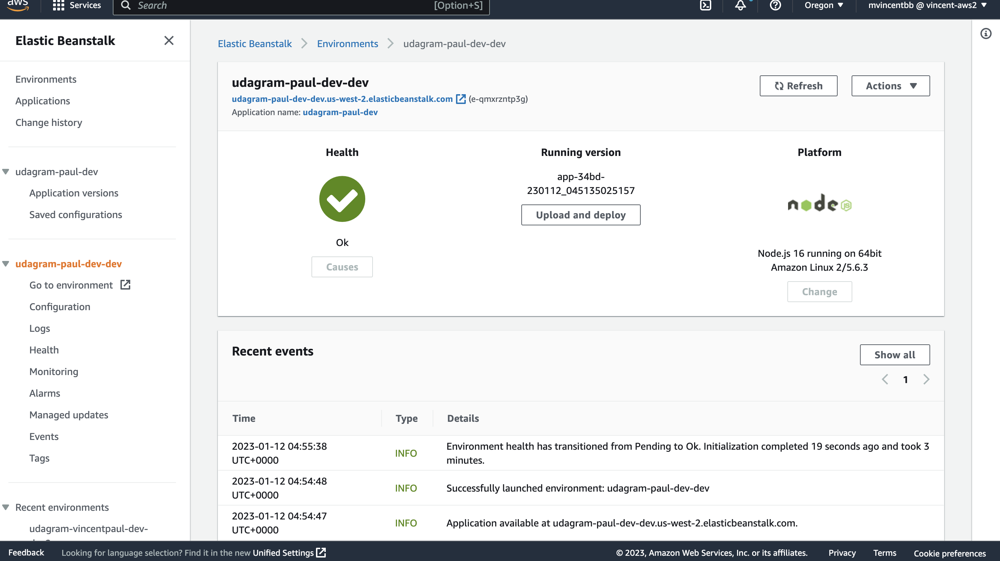

# Udagram Image Filtering Microservice

Udagram is a simple cloud application developed alongside the Udacity Cloud Engineering Nanodegree. It allows users to register and log into a web client, post photos to the feed, and process photos using an image filtering microservice.

This is split into three parts:
1. [The Simple Frontend](https://github.com/udacity/cloud-developer/tree/master/course-02/exercises/udacity-c2-frontend)
A basic Ionic client web application which consumes the RestAPI Backend. 
2. [The RestAPI Backend](https://github.com/udacity/cloud-developer/tree/master/course-02/exercises/udacity-c2-restapi), a Node-Express server which can be deployed to a cloud service. 
3. [The Image Filtering Microservice](https://github.com/udacity/cloud-developer/tree/master/course-02/project/image-filter-starter-code), the final project for the course. It is a Node-Express application which runs a simple script to process images. 

### Setup Node Environment

You'll need to create a new node server. Open a new terminal within the project directory and run:

1. Initialize a new project: `npm i`
2. Run the development server with `npm run dev`

### Setup of EB CLI
1. Install EB CLI on my local machine
2. Use aws credential (AWS ACCESS KEY  and SECRET ACCESS KEY)
3. Run  `eb int`  to create `.elasticbeanstack/config.yml` file
4. Run `eb create` to deploy my application for the first time to AWS ElasticBean
5. To deploy some change in the code run `eb deploy`

### Create a new endpoint in the server.ts file
In the file `./src/server.ts` I create a new endpoint in which I use query parameter to download an image from a public URL, filter the image, and return the result.

### Screenshot

### My Elastic Beanstalk Endpoint
http://udagram-paul-dev-dev.us-west-2.elasticbeanstalk.com

[http://udagram-paul-dev-dev.us-west-2.elasticbeanstalk.com/filteredimage?image_url=https://www.imedias.pro/wp-content/themes/bootstrap-basic4-child/images/cours/images_web/fleurs_violettes.jpg
](http://udagram-paul-dev-dev.us-west-2.elasticbeanstalk.com/filteredimage?image_url=https://www.imedias.pro/wp-content/themes/bootstrap-basic4-child/images/cours/images_web/fleurs_violettes.jpg)